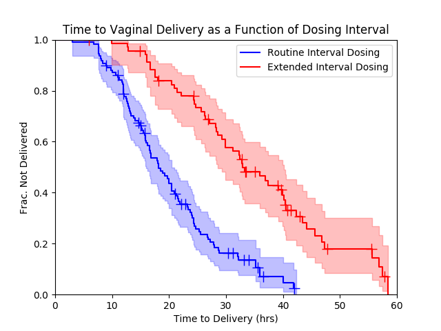

# DeliveryDelays

Misoprostol is a drug commonly used to induce women to give birth.  The drug is given repeatedly, usually once every 4 hours, until the patient delivers their baby.  Sometimes for a variety of reasons, patients don't get their 
doses on time.  My wife is an OB/GYN and this project arose from her observation that in cases where the doses aren't delivered on time, women take much longer to give birth.  This is a problem because the longer women spend in 
labor, the more likely they are to need a caesarean section or have other complications.

--------
The Data
--------

In order to address the question of whether following the dosing interval guidelines for misoprostol affects the time it takes women to give birth, retrospective data on dosing intervals and time to delivery (or c-section/other 
operative delivery) were collected.  The data included in this repository has been preprocessed and includes only the relevant fields as a framework to discuss the techniques used for analysis.

--------
Analysis
--------

For this analysis, we have two groups - cases where the dosing interval guidelines were followed and those where they weren't - and we'd like to compare the rate at which women in each of these groups deliver.  Fortunately the 
Kaplan-Meier estimator, which is more commonly used to estimate survival (i.e. do mice with a given disease survive longer on treatment A or B), is perfectly applicable to this scenario.  In our case, normal births are analogous 
to deaths and operative deliveries are censorship events (since we don't know how much longer a woman would have labored without outside intervention).  We can perform this analysis easily using the lifelines package in python:

