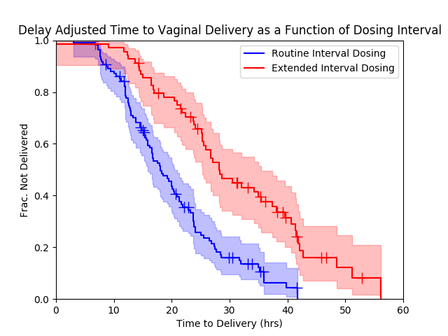
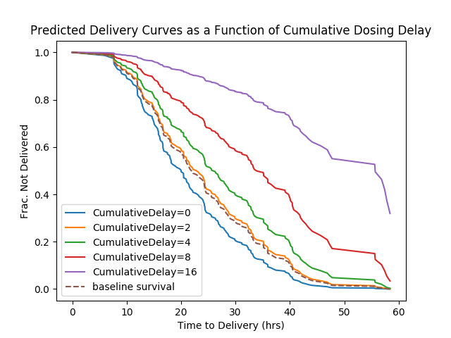

# DeliveryDelays

Misoprostol is a drug commonly used to induce women to give birth.  The drug is given repeatedly, usually once every 4 hours, until the patient delivers their baby.  Sometimes for a variety of reasons, patients don't get their 
doses on time.  My wife is an OB/GYN and this project arose from her observation that in cases where the doses aren't delivered on time, women take much longer to give birth.  This is a problem because the longer women spend in 
labor, the more likely they are to need a caesarean section or have other complications.

--------
The Data
--------

In order to address the question of whether following the dosing interval guidelines for misoprostol affects the time it takes women to give birth, retrospective data on dosing intervals and time to delivery (or c-section/other 
operative delivery) were collected.  The data included in this repository has been preprocessed and includes only the relevant fields as a framework to discuss the techniques used for analysis.

--------
Analysis
--------

For this analysis, we have two groups - cases where the dosing interval guidelines were followed and those where they weren't - and we'd like to compare the rate at which women in each of these groups deliver.  Fortunately the 
Kaplan-Meier estimator, which is more commonly used to estimate survival (i.e. do mice with a given disease survive longer on treatment A or B), is perfectly applicable to this scenario.  In our case, normal births are analogous 
to deaths and operative deliveries are censorship events (since we don't know how much longer a woman would have labored without outside intervention).  We can perform this analysis easily using the lifelines package in python:

There is clear divergence between the 95% confidence intervals for the two groups, and it is obvious that failure to follow the dosing interval guidelines results in longer labors.  Even though the result supports our initial 
hypothesis, this is where the really interesting technical question surfaced.  Is the increase in labor a 1:1 product of the delay in dosing or does a delay in dosing produce a disproportionate increase in labor times?  Another 
way of phrasing this would be to ask if a 1 hour delay in the dosing interval would be expected to produce a 1 hour increase in labor times or a much larger increase?  This question is important because many of the deviations from 
the dosing interval guidelines were on a timescale that isn't clinically significant for labor.  The solution to this question is actually quite simple; all we need to do is adjust the times to delivery by subtracting the delays 
in dosing and see if the Kaplan-Meier curves still differ:

The difference between the curves has decreased as one would expect, but they are still quite distinct.  From this we can conclude that the contribution of dosing delays to time in labor is greater than 1:1.  What exactly is the 
contribution though, and how much of an increase in labor time can we expect based on a given delay?  This question can be answered with a Cox Proportional Hazard Model:

As you can see, a ~4 hour delay in dosing can be expected to result in an ~10 hour increase in labor time, emphasizing the importance of timely dosing. 

----
Built With
----

* numpy
* pandas
* lifelines

-------
License
-------

© 2017 Alexander M. Crowell: BSD-3
